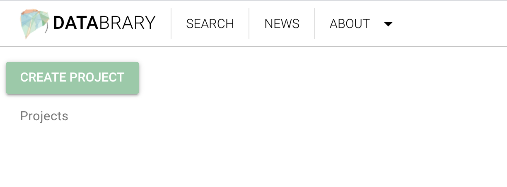

```{r, echo=FALSE}

```

# Purpose

This is a user's dashboard or primary landing page.
It is the view  **after users log-in**.

# Routes

## API

- databrary.org/my
- nyu.databrary.org/my
- databrary.org/dashboard
- nyu.databrary.org/dashboard

## From

- [login](login.html)
- [databrary.org](index.html)

## To

```{r child = 'headerLinks.Rmd'}
```

- [myProjects](myProjects.html)
- [myPeople](myPeople.html)
- [settings](settings.html)
- [profile](profile.html)

# Actions

- Create project(s), [ProjectCreate](ProjectCreate.html)
- Manage people
- Edit profile
- Edit other settings
- Browse (public + shared) projects on Databrary
- Learn about Databrary

# Comments

- if (loggedIn == TRUE) {[LandingLoggedIn](LandingLoggedIn.html)} else {[LandingLoggedOut](LandingLoggedOut)}
- (TODO) Different components if user is authorized vs. not authorized.
    - if (userAuthorized == FALSE) {show [landingPageNoAuth](landingPageNoAuth.html)]} else {show [landingPageAuth](landingPageAuth.html))}