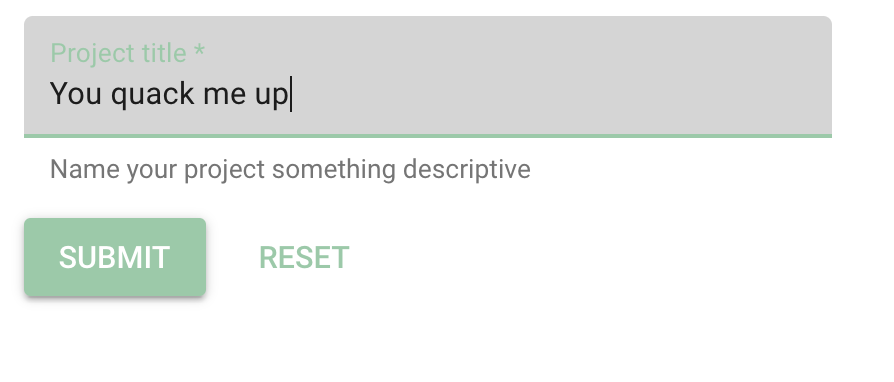

```{r, echo=FALSE, out.width="50%", fig.align='center'}

```

# Purpose

This page allows users to create a new Project.

# Routes

## API

- databrary.org/project/create
- nyu.databrary.org/project/create

## From

- [projectPage](projectPage.html)
- [myProjects](myProjects.html)

## To

- [projectPage](projectPage.html) for newly created project, e.g., project/<id>

# Actions

- Create (name) new project

# Comments

- Detect duplicate project names before creation?
- Access from [landingLoggedIn](LandingLoggedIn.html) also?
