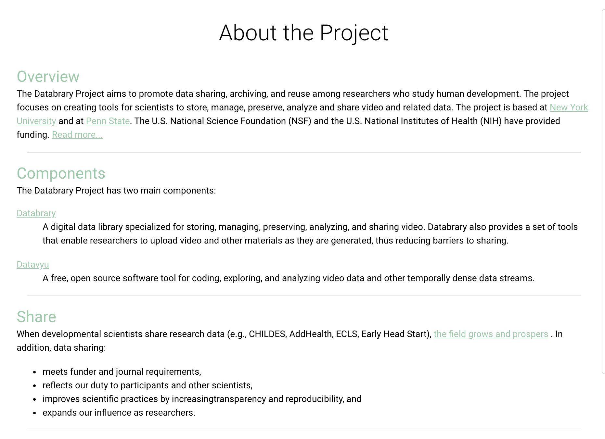

```{r echo=FALSE}

```

# Purpose

This page provides information about the Databrary project.

# Routes

## API

- databrary.org/about/project
- nyu.databrary.org/about/project

## From

- [databrary.org](index.html)

## To

# Comments

- Can we combine this with [aboutDatabrary](aboutDatabrary.html)?