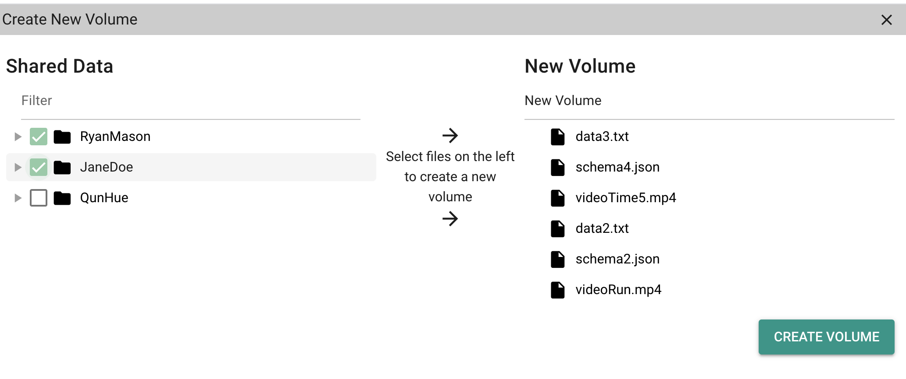

```{r, echo=FALSE}

```

# Purpose

This page allows users to copy materials from one Project to another Project.

# Routes

## API

- databrary.org/project/<id>/copy
- nyu.databrary.org/project/<id>/copy

## From

- [projectPage](projectPage.html)

## To

# Actions

- Select all files in source Project and copy to (new or existing) target Project
- (2.1?) select subset of files in source Project and copy to (new or existing) target Project

# Comments

- Access from [landingLoggedIn](LandingLoggedIn.html) also?
