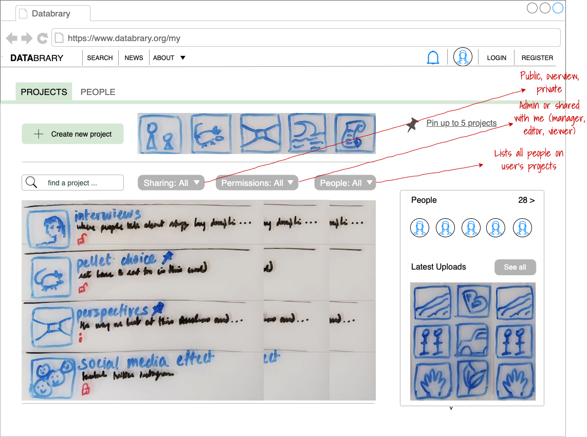

Dashboard overview
```{r, echo=FALSE}

```

---

# Purpose

This is a user's dashboard or primary landing page.
It is where users land after they log-in from the Databrary home page.

# Routes

## API

- databrary.org/my
- databrary.org/dashboard

## From

- [login](login.html)
- [databrary.org](index.html)

## To

```{r child = 'headerLinks.Rmd'}
```

- [thisProject](thisProject.html) from "Create project" button
- [manageProjects](myProjectsManage.html) page through "Edit project permissions" button
- [auditProjects](myProjectsAudit.html) page through "Audit my projects" button
- [settings](settings.html) through "Update my profile" button
- [search](search.html) page through "search people" button
- [search](search.html) results page of all users belonging to /my/org through "browse colleagues" button
- [person] public pages of other users page from the "people" section
- [org] public page of user's own institution page from the "people" section
- [static pages] mostly from the "support" section of the header links

# Actions

- Create project (modal - takes user to [thisProject](thisProject.html) on save)
- View projects
  - recently updated (default)
  - shared by others (option)
  - belonging to specific user groups (option)
  - belonging to specific project groups (option)
- Search for projects
- Update profile button takes user to [settings](settings.html)
- View people
  - collaborators (default)
  - colleagues (default)
- Search for people
- View latest (public + shared) projects on Databrary
- ~Manage people~
- ~Edit profile~ (always available through header avatar)
- ~Edit other settings~ (always available through header avatar)
- ~Learn about Databrary~  (always available through header avatar)

# Comments

- if (userAuthorized == FALSE) {show [dashboardNoAuth](dashboardNoAuth.html)]} else {show [dashboardAuth](dashboardAuth.html))}

# Quasar

- Here's the Quasar/CodePen code for that drawer layout piece:

---

<!--
  Forked from:
  https://quasar.dev/layout/drawer#Example--Header-Picture
-->
<div id="q-app">
  <div class="q-pa-md">
    <q-layout view="lHh Lpr lff" container style="height: 600px" class="shadow-2 rounded-borders">
      <q-header elevated class="bg-cyan-8">
        <q-toolbar>
          <q-toolbar-title>Projects</q-toolbar-title>
          <q-btn flat @click="drawer = !drawer" round dense icon="menu"></q-btn>
        </q-toolbar>
      </q-header>

      <q-drawer
        v-model="drawer"
        show-if-above
        :width="200"
        :breakpoint="400"
      >
        <q-scroll-area style="height: calc(100% - 150px); margin-top: 150px; border-right: 1px solid #ddd">
          <q-list padding>
            <q-item clickable v-ripple>
              <q-item-section avatar>
                <q-icon name="add"></q-icon>
              </q-item-section>

              <q-item-section>
                CREATE NEW
              </q-item-section>
            </q-item>

            <q-item active clickable v-ripple>
              <q-item-section avatar>
                <q-icon name="history"></q-icon>
              </q-item-section>

              <q-item-section>
                Recently updated
              </q-item-section>
            </q-item>

            <q-item clickable v-ripple>
              <q-item-section avatar>
                <q-icon name="work"></q-icon>
              </q-item-section>

              <q-item-section>
                Projects I own
              </q-item-section>
            </q-item>

            <q-item clickable v-ripple>
              <q-item-section avatar>
                <q-icon name="supervisor_account"></q-icon>
              </q-item-section>

              <q-item-section>
                Shared with me
              </q-item-section>
            </q-item>

            <q-item clickable v-ripple>
              <q-item-section avatar>
                <q-icon name="supervised_user_circle"></q-icon>
              </q-item-section>

              <q-item-section>
                User groups
              </q-item-section>
            </q-item>

            <q-item clickable v-ripple>
              <q-item-section avatar>
                <q-icon name="bookmarks"></q-icon>
              </q-item-section>
              
              <q-item-section>
                Project groups
              </q-item-section>
            </q-item>

          </q-list>
        </q-scroll-area>

        <q-img class="absolute-top" src="https://cdn.quasar.dev/img/material.png" style="height: 150px">
          <div class="absolute-bottom bg-transparent">
            <q-avatar size="56px" class="q-mb-sm">
              
            </q-avatar>
            <div class="text-weight-bold">Ruth Ginsburg</div>
            <div>University of Michigan</div>
          </div>
        </q-img>
      </q-drawer>

      <q-page-container>
        <q-page padding>
          <p v-for="n in 4" :key="n">
                <q-avatar rounded size="100px" font-size="82px" color="teal" text-color="white" icon="directions"></q-avatar> 
                <q-avatar rounded size="24px" color="orange">E</q-avatar>
                <q-avatar rounded size="24px" color="orange">V</q-avatar>
            Project name & description&nbsp; &nbsp; &nbsp; &nbsp; 
                <q-avatar rounded size="100px" font-size="82px" color="teal" text-color="white" icon="directions"></q-avatar> 
                <q-avatar rounded size="24px" color="orange">E</q-avatar>
                <q-avatar rounded size="24px" color="orange">V</q-avatar>
            Project name & description&nbsp; &nbsp; &nbsp; &nbsp;           </p>
        </q-page>
      </q-page-container>
    </q-layout>
  </div>
</div>

---


