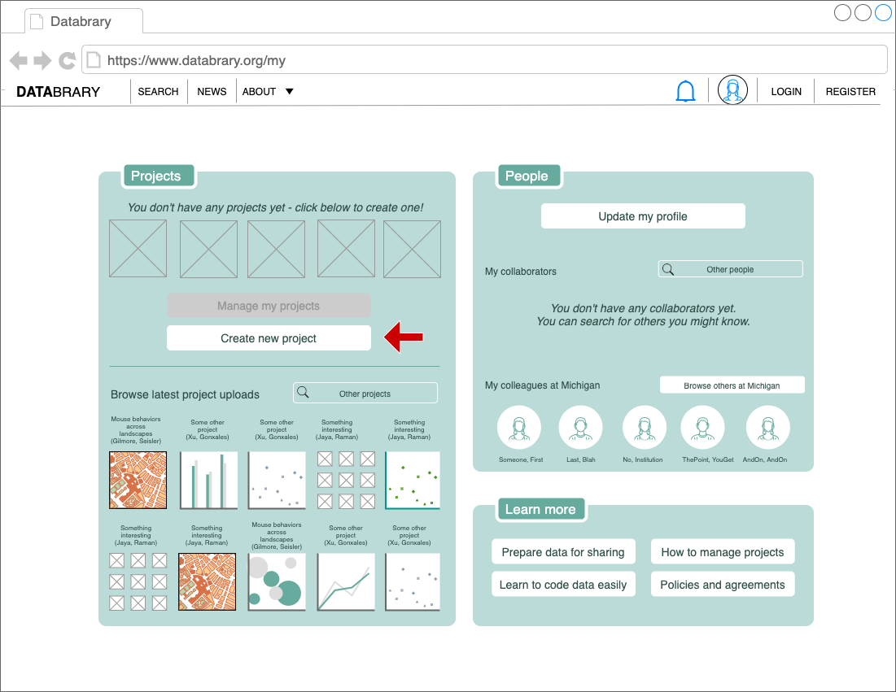

```{r, echo=FALSE}

```

# Purpose

This is a user's dashboard or primary landing page.
It is where users land after they log-in from the Databrary home page.
This page has special features for users who are not authorized.

# Routes

## API

- databrary.org/my
- databrary.org/dashboard

## From

- [login](login.html)
- [databrary.org](index.html)

## To

```{r child = 'headerLinks.Rmd'}
```

_(We need to finalize our permissions matrix to nail this piece)_
- [thisProject](thisProject.html) from "Create project" button
- [myProjects](myProjects.html) page through "View all" button
- [manageProjects](myProjectsManage.html) page through "Edit project permissions" button
- [auditProjects](myProjectsAudit.html) page through "Audit my projects" button
- [search](search.html) page through "search people" button
- [search](search.html) results page of all users belonging to /my/org through "browse colleagues" button

# Actions

_(We need to finalize our permissions matrix to nail this piece)_
- Create project (modal - takes user to [thisProject](thisProject.html) on save)
- View projects
  - recently updated (default)
  - shared by others (option)
  - belonging to specific user groups (option)
  - belonging to specific project groups (option)
- Search for projects
- View people
  - collaborators (default)
  - colleagues (default)
- Search for people
- View latest (public + shared) projects on Databrary
- ~Manage people~
- ~Edit profile~ (always available through header avatar)
- ~Edit other settings~ (always available through header avatar)
- ~Learn about Databrary~  (always available through header avatar)

# Comments

- if (userAuthorized == FALSE) {show [dashboardNoAuth](dashboardNoAuth.html)]} else {show [dashboardAuth](dashboardAuth.html))}