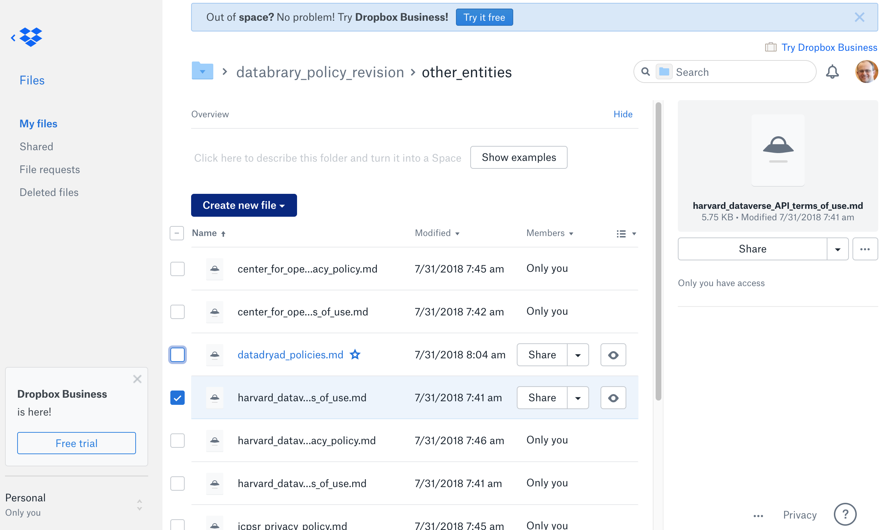

```{r, echo=FALSE}

```

# Purpose

This page shows the files associated with a project.
This is where users edit and upload files.

# Routes

## API

- databrary.org/project/<id>/files
- nyu.databrary.org/project/<id>/files
- databrary.org/my/project/<id>/files
- nyu.databrary.org/my/project/<id>/files

## From

- [projectPage](projectPage.html)

## To

```{r child = 'headerLinks.Rmd'}
```

- [projectPage](projectPage.html)

# Actions

- Browse
- Edit files
- Upload files
- Download files
- Copy files to...
- Share files...

# Comments

- The sample image is from Dropbox, but it is similar to ones from Google Drive and Box.
