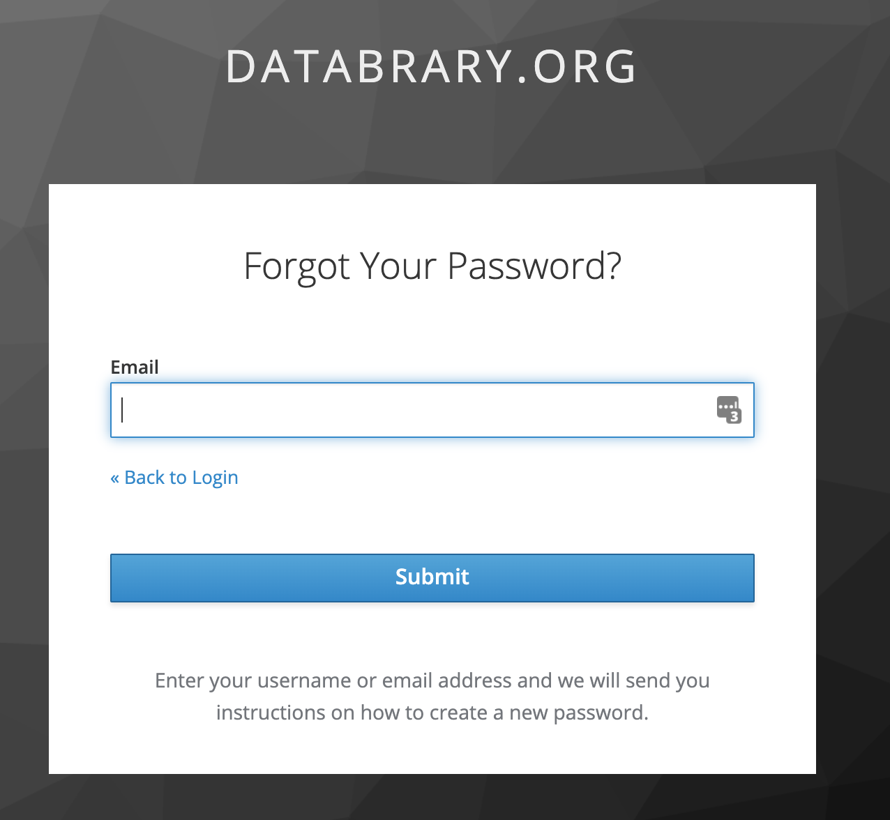

```{r, echo=FALSE, out.width="50%", fig.align='center'}

```

# Purpose

This page (modal dialog) allows a user to deal with a forgotten password.

# Routes

## API

- databrary.org/register
- nyu.databrary.org/register

## From

- [login](login.html)

## To

- [login](login.html)

# Actions

- Submit
- Back to login

# Comments

