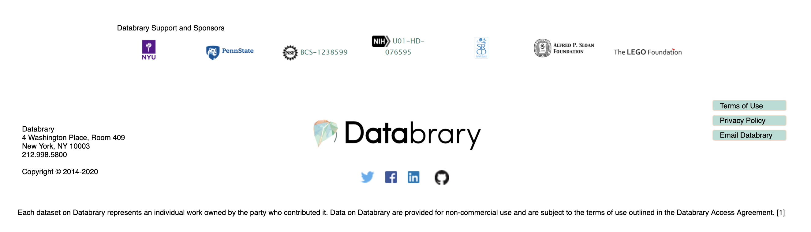

```{r, echo=FALSE}


```

# Purpose

This is the Databrary home page with footer.

# Routes

## API

- databrary.org/
- nyu.databrary.org/

## From

## To

```{r child = 'headerLinks.Rmd'}
```


# Comments
- If user is logged in, should this page direct to databrary/org/my ?
- Should `login` menu item toggle between `login` and `logout` depending on state?


