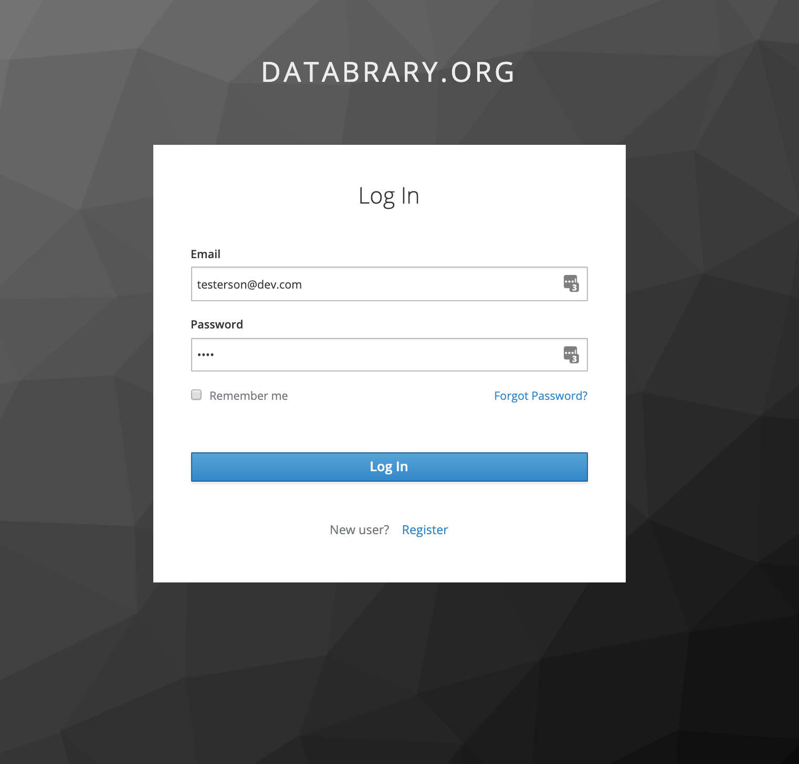

```{r, echo=FALSE, out.width="50%", fig.align='center'}

```

# Purpose

This page controls site logins.

# Routes

## API

- databrary.org/login
- nyu.databrary.org/login

## From

- Avatar login menu item on [databrary.org](databrary.org.html)

## To

- [forgotPassword](forgotPassword.html)
- [register](register.html)
- dashboard
    - Option 1: [my](my.html)
    - if (loggedIn) {if (userNotAuthored) {LandingLoggedInNoAuth} else {LandingLoggedInNoAuth}}

# Actions

- [forgotPassword](forgotPassword.html)
- [register](register.html)
- submitButton
    - Submits credentials to authentication routines

# Comments

- Must handle loggedIn state and user authorization state to determine which dashboard/landing page is shown.