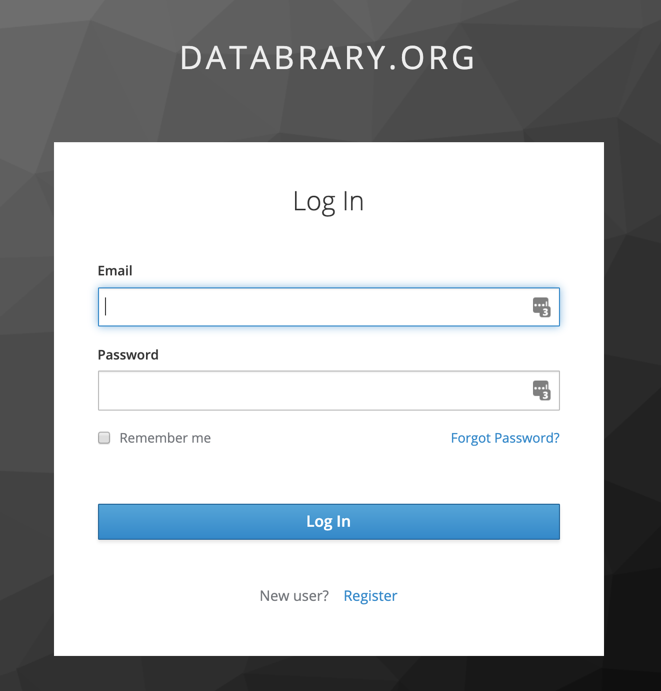

```{r, echo=FALSE, out.width="50%", fig.align='center'}

```

# Purpose

This page controls site logins.

# Routes

## API

- databrary.org/login
- nyu.databrary.org/login

## From

- [databrary.org](databrary.org.html)

## To

- [forgotPassword](forgotPassword.html)
- [register](register.html)
- dashboard

# Actions

- [forgotPassword](forgotPassword.html)
- [register](register.html)
- submitButton

# Comments

 - if (userAuthorized == true) {[Authorized Investigator dashboard](landingPageAuth.html)} else {[Unsupervised User dashboard](landingPageNoAuth.html)}