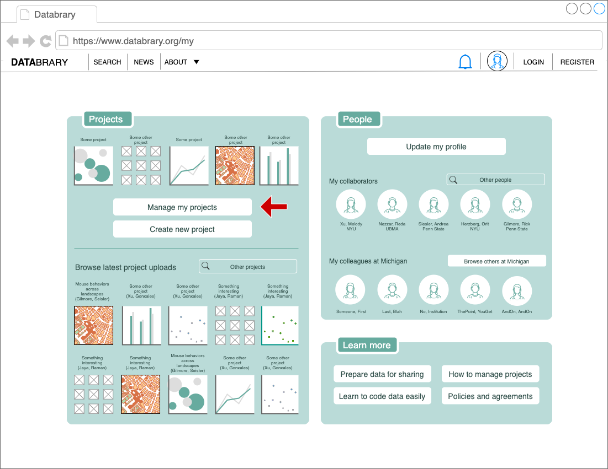

```{r, echo=FALSE}
#
```

# Purpose

This page allows a user to visualize and edit their projects.

# Routes

## API

- databrary.org/my/projects
- nyu.databrary.org/my/projects

## From

- [login](login.html)
- User avatar dropdown from [databrary.org](index.html)
- [dashboard](landingPageAuth.html)
- [people](myPeople.html)

## To

- [people](myPeople.html)
- [settings](settings.html)
- [profile](profile.html)
- [dashboard](landingPageAuth.html)
- [ProjectCreate](ProjectCreate.html)

# Actions

- Create new projects via [ProjectCreate](ProjectCreate.html)
- Access existing projects [List Projects](myProjects.html)
- Delete projects
- Edit projects
- Share projects (with specific people) [ProjectPermissions](myProjectsPermissions.html)
- Share projects (with Databrary)
- Get data about projects [Project Audit](myProjectsAudit.html)

# Comments

- (TODO:Swapnaa) Is this what we've been calling the landing page ([LandingLoggedIn](LandingLoggedIn.html)) or 'dashboard', or is it the [myProjects](myProjects.html) page? 
Also, `img/myProjects2a_regular.png` did not get pushed to the repo. 
I commented this out so the site will render.
Can we link to draw.io URLs?
Finally, did you delete the landing page for newly registered (landingNoAuth, landingAuth) users?
- If this is the 

First-time users will see this:
```{r, echo=FALSE}
#knitr::include_graphics("img/myProjects2a_firsttime.png")
```

Users with under 5 projects will see this:
```{r, echo=FALSE}
#knitr::include_graphics("img/myProjects2a_under5.png")
```

