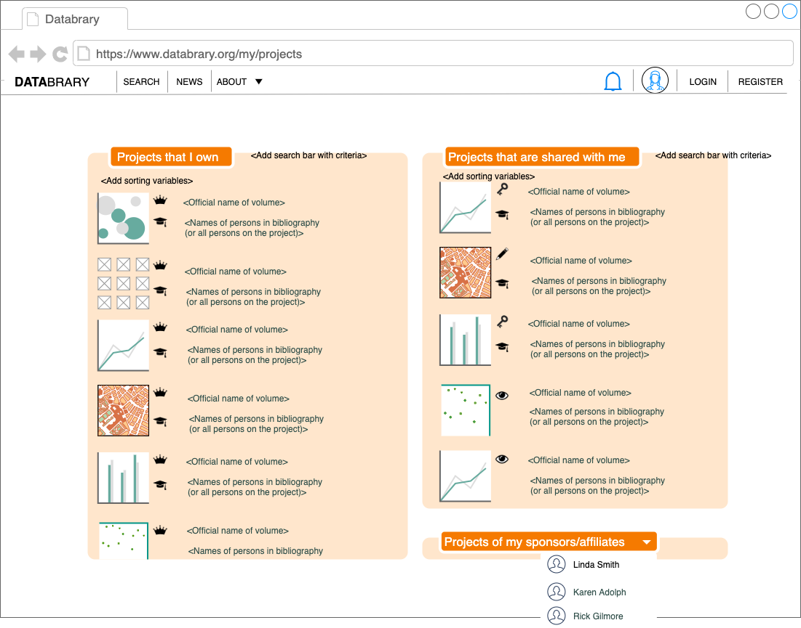

```{r, echo=FALSE}

```

# Purpose

This page allows a user to visualize and edit their projects.
This page is separate from the dashboard.

# Routes

## API

- databrary.org/my/projects

## From

- [login](login.html)
- [databrary.org](index.html)
- [dashboard](landingPageAuth.html)
- [people](myPeople.html)

## To

- [people](myPeople.html)
- [settings](settings.html)
- [profile](profile.html)
- [dashboard](landingPageAuth.html)
- [ProjectCreate](ProjectCreate.html)

# Actions/Implementations

- *Browse* projects
  - 'Projects I own'
    - Default sort on most recently edited
    - Change sort by name, shared status
    - Show grid/card-like view with thumbnail or switch to list view
  - 'Projects shared with me' ('Shared with me')
    - Default sort on most recently edited
    - Select sort by name, shared status
    - Show grid/card=like view with thumbnail or switch to list view
  - 'Projects of my sponsors'
    - Drop down to select sponsor, select takes to `databrary.org/person/<id>/projects`
- *Edit* projects
  - How select edit mode?
  - Edit in place or switch to [projectPage](projectPage.html) aka `databrary.org/project/<id>`?
    - If edit in place, allow editing of
      - Name
      - Sharing status
    - To edit people, switch to [myPeople](myPeople.html) for selected project.
- *Delete* projects
  - How delete? Make two-step process with confirmation.
- *Create* new projects
  - `Create Project` button -> [ProjectCreate](ProjectCreate.html)
- *Share* projects 
    - (with specific people) [ProjectPermissions](myProjectsPermissions.html)
    - (with Databrary)
- *Audit* (Get data about projects) [Project Audit](myProjectsAudit.html)

# Comments
