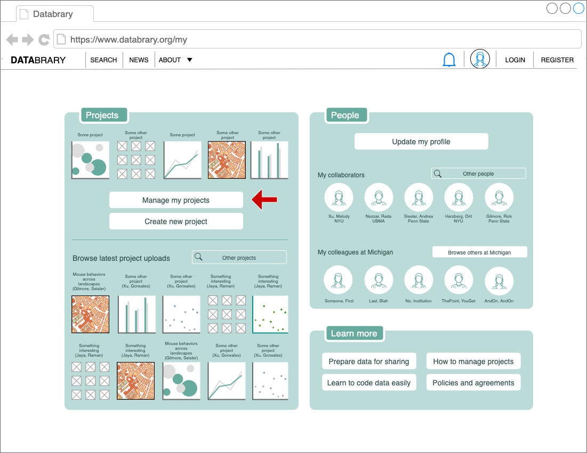
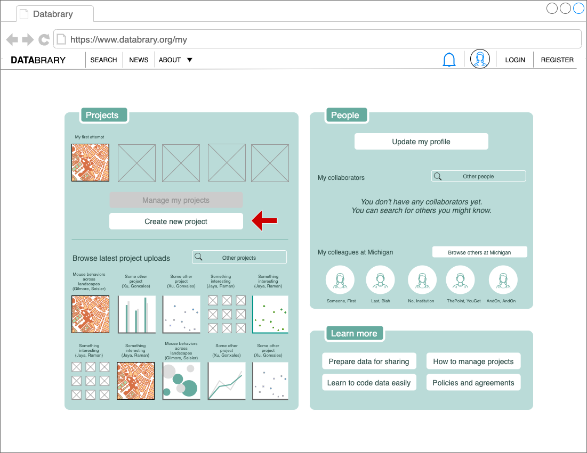

```{r, echo=FALSE}

```

# Purpose

This page allows a user to visualize and edit their projects.

# Routes

## API

- databrary.org/my/projects
- nyu.databrary.org/my/projects

## From

- [login](login.html)
- [databrary.org](index.html)
- [dashboard](landingPageAuth.html)
- [people](myPeople.html)

## To

- [people](myPeople.html)
- [settings](settings.html)
- [profile](profile.html)
- [dashboard](landingPageAuth.html)
- [ProjectCreate](ProjectCreate.html)

# Actions

- Browse new projects
- Create new projects via [ProjectCreate](ProjectCreate.html)
- Access existing projects
- Delete projects
- Edit projects
- Share projects (with specific people) [ProjectPermissions](myProjectsPermissions.html)
- Share projects (with Databrary)
- Get data about projects [Project Audit](myProjectsAudit.html)

# Comments

First-time users will see this:
```{r, echo=FALSE}
knitr::include_graphics("img/myProjects2a_firsttime.png")
```

Users with under 5 projeccrs will see this:
```{r, echo=FALSE}

```

