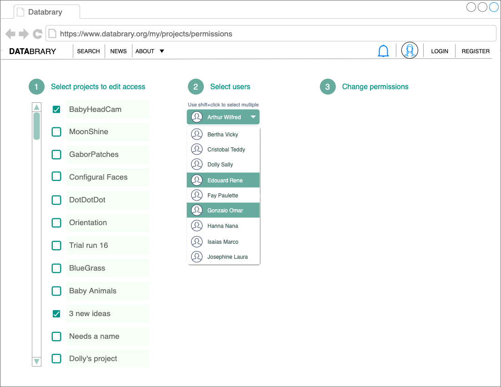

```{r, echo=FALSE}

```

# Purpose

This page allows a user to visualize and edit project permissions for multiple projects at a time.
It also allows editing permissions for multiple people at a time.

# Routes

## API

- ?

## From

- [login](login.html)
- [databrary.org](index.html)
- [dashboard](landingPageAuth.html)
- [people](myPeople.html)
- [projects](myProjects.html)

## To

- haven't edited this yet
- [people](myPeople.html)
- [settings](settings.html)
- [profile](profile.html)
- [dashboard](landingPageAuth.html)
- [ProjectCreate](ProjectCreate.html)

# Actions

- haven't edited this yet
- Create new projects via [ProjectCreate](ProjectCreate.html)
- Access existing projects
- Delete projects
- Edit projects
- Share projects (with specific people)
- Share projects (with Databrary)
- Get data about projects

# Comments

