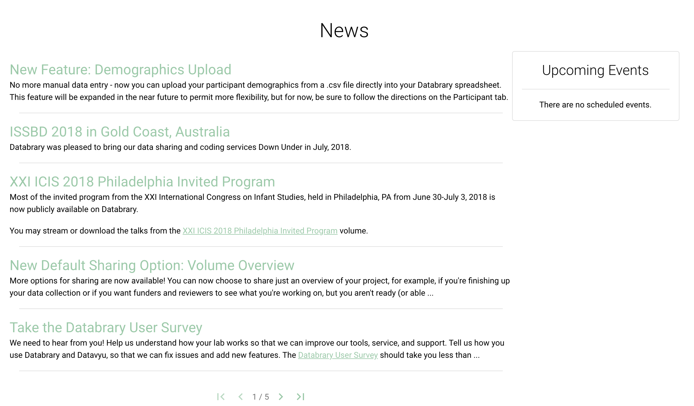

```{r echo=FALSE}

```

# Purpose

This page summarizes news about the Databrary project.

# Routes

## API

- databrary.org/news
- nyu.databrary.org/news

## From

- [databrary.org](index.html)

## To

# Comments

- Should this page feature a "feed" with new projects (https://gilmore-lab.github.io/databrary-analytics/weekly/databrary_weekly_report.html#2_volumes) and newly added users (https://gilmore-lab.github.io/databrary-analytics/weekly/databrary_weekly_report.html#1_institutions__authorized_users) like that generated for the weekly report 