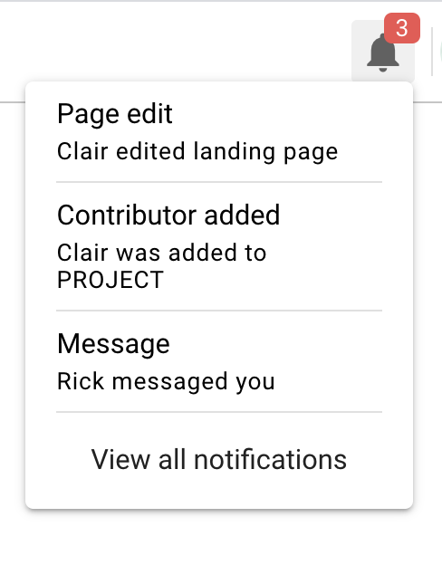

```{r echo=FALSE, out.width="25%", fig.align='center'}

```

# Purpose

This popup provides information about notifications

# Routes

## API

- databrary.org/notifications
- nyu.databrary.org/notifications

## From

- [databrary.org](index.html)

## To

- more information about each specific notification

# Comments

- (2.0) Push notifications from Databrary.
- (2.1+) Other notification alerts.