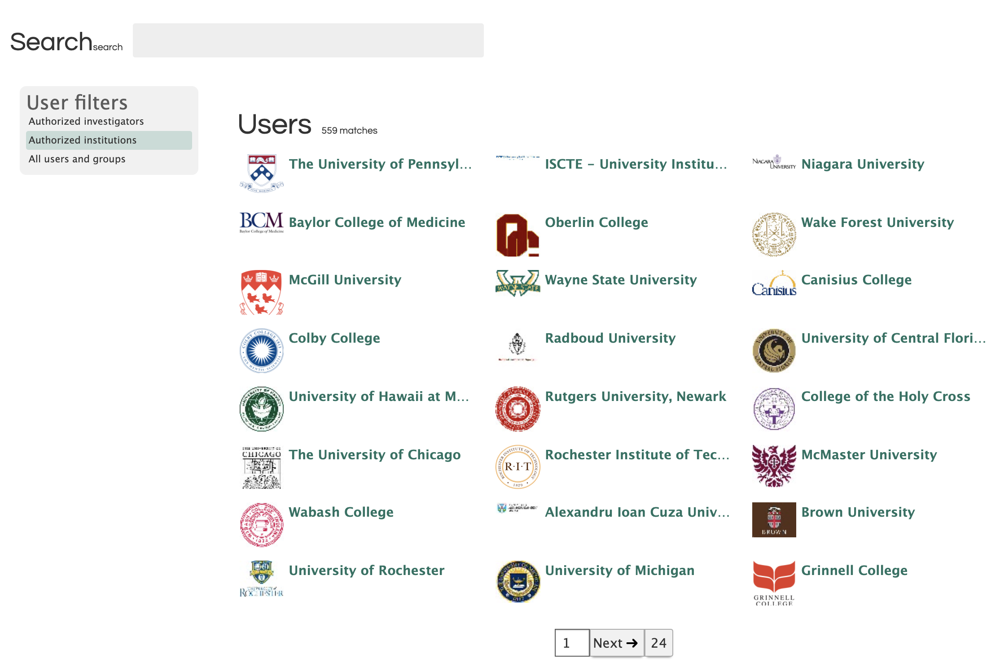

```{r, echo=FALSE, fig.align='center', out.width="100%"}

```

# Purpose

This page presents a gallery of institutions.

See <https://nyu.databrary.org/search?offset=0&volume=false&f.party_authorization=5&f.party_is_institution=true>

# Routes

## API

- databrary.org/orgs
- nyu.databrary.org/orgs
- databrary.org/search/orgs
- nyu.databrary.org/search/orgs

## From

- [databrary.org/community](index.html)

## To

```{r child = 'headerLinks.Rmd'}
```

- [Selected org](thisOrg.html)

# Actions

- Browse
- Search for/filter

# Comments

