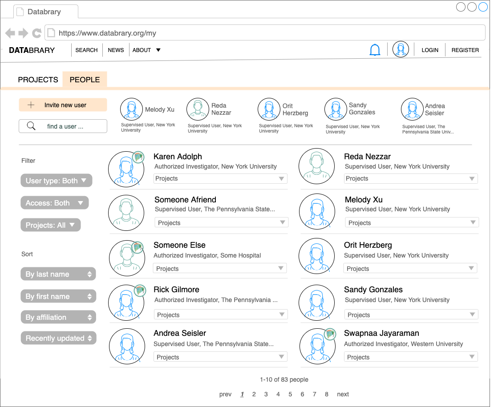

```{r, echo=FALSE}

```

# Purpose

This page presents a gallery of users on Databrary.

See <https://nyu.databrary.org/search?volume=false&f.party_authorization=4&f.party_is_institution=false>

# Routes

## API

- databrary.org/people
- databrary.org/search/people

## From

## To

```{r child = 'headerLinks.Rmd'}
```

# Actions

- Browse
- Search for/filter

# Comments

