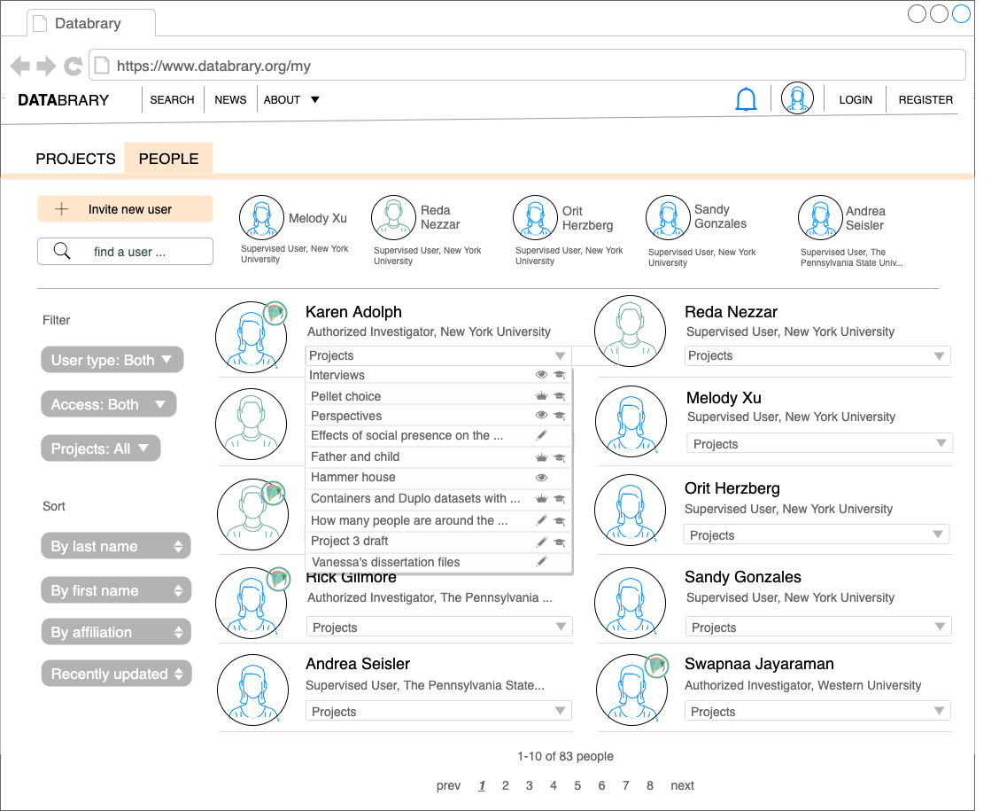

## {.tabset .tabset-fade}
Basic appearance and dropdown behaviors

### Basic

```{r, echo=FALSE}
knitr::include_graphics("img/people.png")
```

### Dropdown

```{r, echo=FALSE}

```

### Filter and sort explained

Filtering will show a subset of all (default will be to show all)

- User type: Authorized Investigators or Supervised Users 
- Access: Databrary-wide or restricted
- Projects: Lists projects and project groups that belong to user (up to 10)


##

# Purpose

This page presents a gallery of users on Databrary.

See <https://nyu.databrary.org/search?volume=false&f.party_authorization=4&f.party_is_institution=false>

# Routes

## API

- databrary.org/people
- databrary.org/search/people

## From

## To

```{r child = 'headerLinks.Rmd'}
```

# Actions

- Browse
- Search for/filter

# Comments

