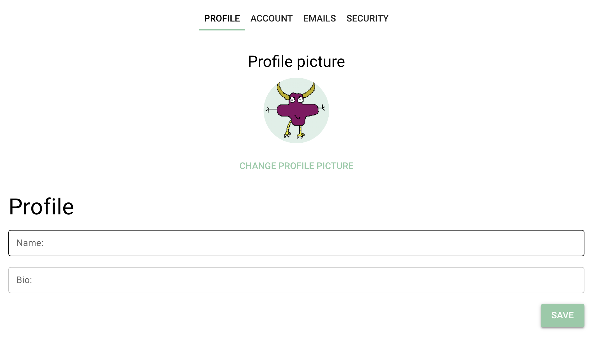

```{r, echo=FALSE}

```

# Routes

This page allows a user to edit their profile information.

## API

- databrary.org/my/settings/profile
- nyu.databrary.org/my/settings/profile
- databrary.org/my/profile
- nyu.databrary.org/profile

## From

- [settings](settings.html)
- [landingPageAuth](landingPageAuth.html)
- [landingPageNoAuth](landingPageNoAuth.html)

## To

```{r child = 'headerLinks.Rmd'}
```

- [profile](profile.html)
- [account](account.html)
- [emails](emails.html)
- [security](security.html)

# Comments


