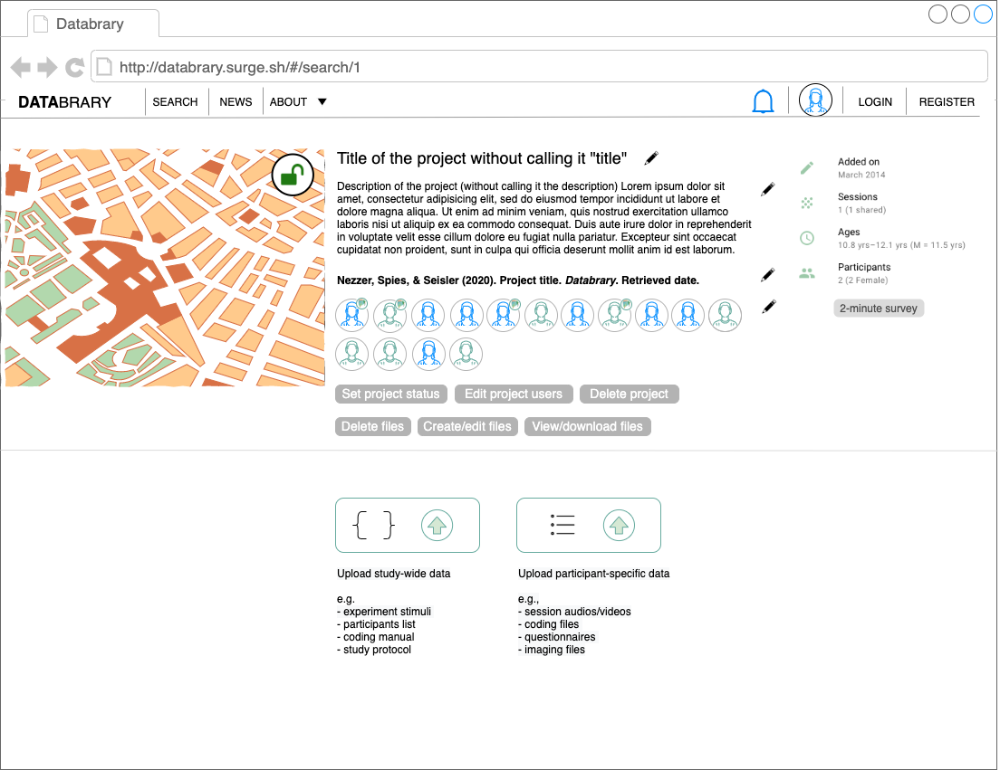

## {.tabset .tabset-fade}
Basic appearance and mouse-over behaviors

### Basic

```{r, echo=FALSE}

```

### Edit title

```{r, echo=FALSE}

```

### Add/remove people

```{r, echo=FALSE}

```

### Hover-users

```{r, echo=FALSE}

```

### Click-permissions-1

```{r, echo=FALSE}

```

### Click-permissions-2

```{r, echo=FALSE}

```

### Permissions explained

- It's a toggle, not mouse-over
- Click on permission to show users with chosen permission
- Click on users to assign or remove chosen permission
- Click on permission again to save
- Can remove "view/download files" this since all users in a project should be able to do both

### Survey

```{r, echo=FALSE}

```

### Upload

```{r, echo=FALSE}

```

### Upload by measure

```{r, echo=FALSE}

```

##

# Purpose

This page represents a typical project page on Databrary.

See <https://nyu.databrary.org/volume/27>

# Routes

## API

- databrary.org/project
- databrary.org/search/people

## From

## To

```{r child = 'headerLinks.Rmd'}
```

# Actions

- Browse
- Search for/filter

# Comments

