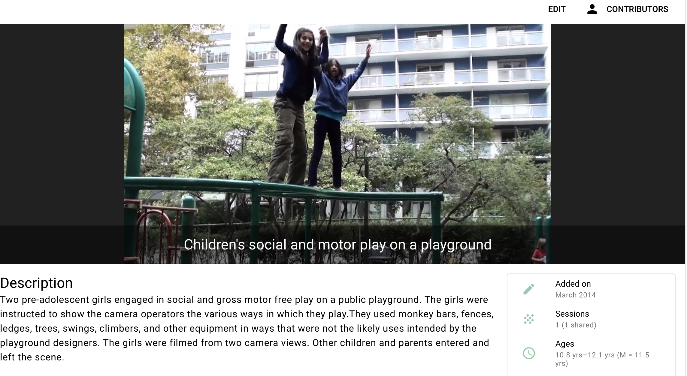

```{r, echo=FALSE}

```

# Purpose

This page is the "face" of individual projects on Databrary.

# Routes

## API

- databrary.org/project/<id>
- nyu.databrary.org/project/<id>
- databrary.org/my/project/<id>
- nyu.databrary.org/my/project/<id>

## From

- [dashboard](landingPageAuth.html)
- [ProjectCreate](ProjectCreate.html)

## To

- editContributors
- [copyProject](copyProject.html)
- [filesPage](filesPage.html)

# Actions

- Browse project (if (userAuthorized == TRUE && projectShared == TRUE))
- Edit project (if (userEditPrivilegesOnProject == TRUE))
    - Edit project data
        - Edit contributors
        - Edit title
        - Edit description
        - Edit sharing status
    - Edit files via [filesPage](filesPage.html)
        - Edit materials
        - Upload data
        - Edit access
- Bookmark project (for later reference)
    - Create array of bookmarked projects, show in dashboard/landing page
- Download project (if ...)
- Copy project to... (if ...)

# Comments

- Do we keep notion of shared (Public) Volume Overview?