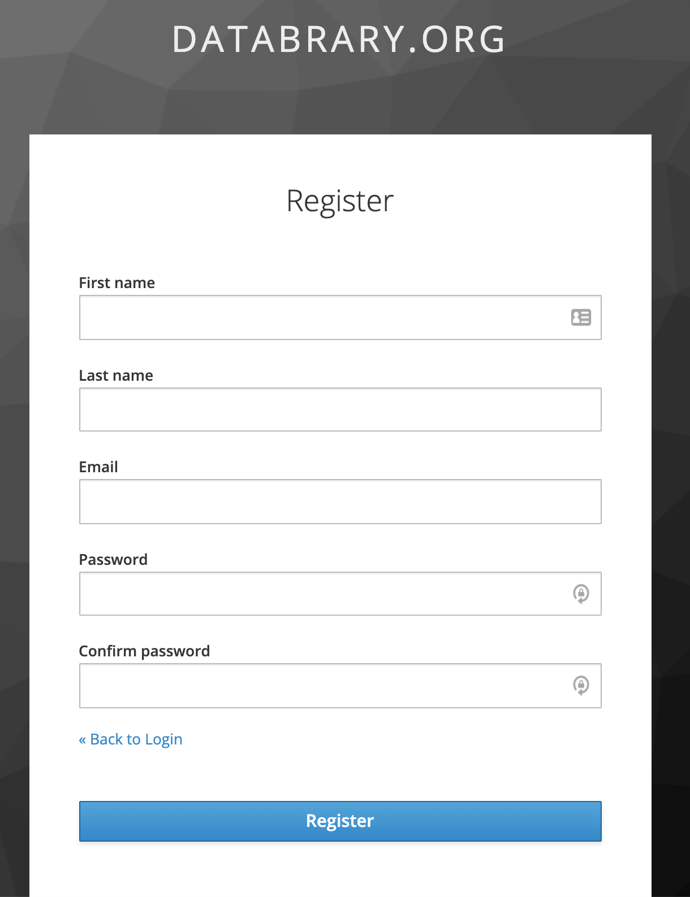

```{r, echo=FALSE, fig.align='center', out.width='50%'}

```

# Purpose

This page (modal dialog) allows a user to register for Databrary.

# Routes

## API

- databrary.org/register
- nyu.databrary.org/register

## From

- [databrary.org](index.html)

## To

- [confirmEmail](confirmEmail.html)

# Actions

- Back to [login](login.html)
- Register brings up [confirmEmail](confirmEmail.html)

# Comments

