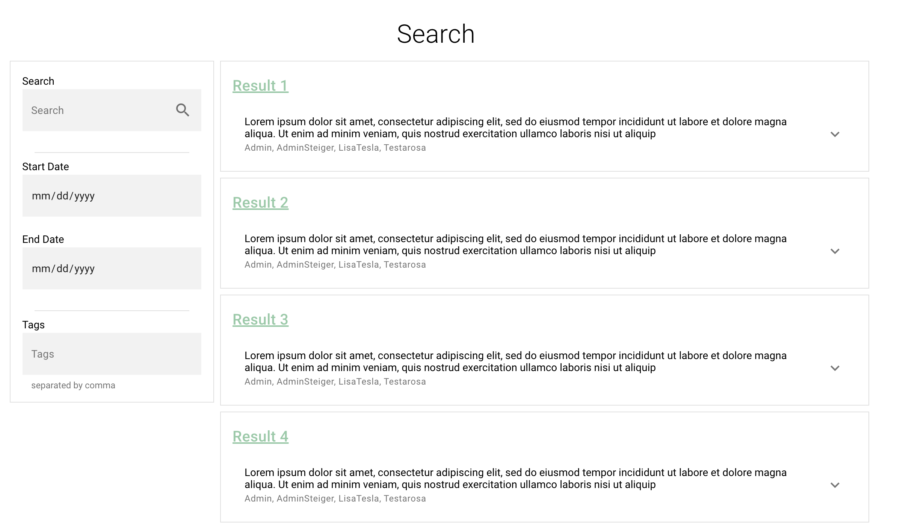

```{r echo=FALSE}

```

# Purpose

This is the main search page.
Users search for Projects or Files here.

# Routes

## API

- databrary.org/search
- nyu.databrary.org/search

## From

- [databrary.org](index.html)

## To

```{r child = 'headerLinks.Rmd'}
```

# Actions

- Search for/filter Projects
    - Text or tags
    - Participant characteristics
    
# Comments
