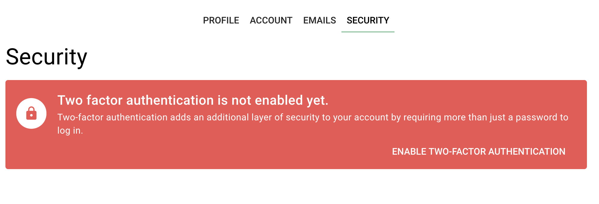

```{r, echo=FALSE}

```

# Purpose

This page allows a user to set additional security settings, e.g. 2FA.

# Routes

## API

- databrary.org/my/settings/security
- nyu.databrary.org/my/settings/security
- databrary.org/my/security
- nyu.databrary.org/security

## From

- [settings](settings.html)
- [landingPageAuth](landingPageAuth.html)
- [landingPageNoAuth](landingPageNoAuth.html)

## To

- [profile](profile.html)
- [account](account.html)
- [emails](emails.html)
- [security](security.html)

# Actions

# Comments


