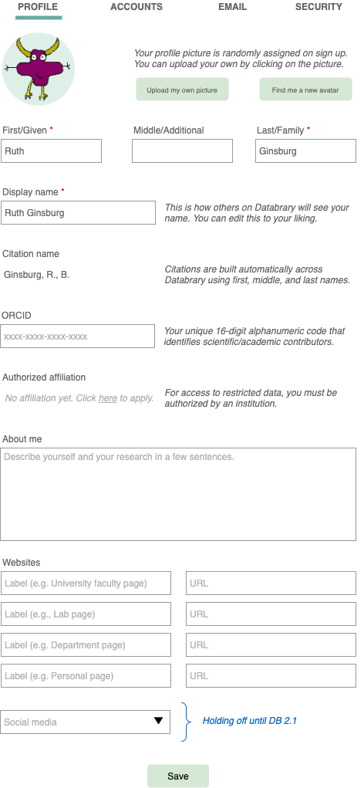
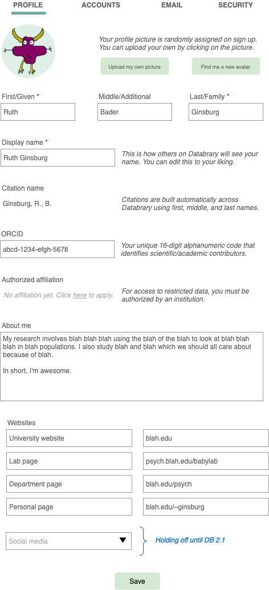

```{r, fig.align="center", echo=FALSE}

```

# Purpose

This page allows a user to edit their settings.

# Routes

## API

- databrary.org/my/settings

## From

- [databrary.org](index.html)
- [landingPageAuth](landingPageAuth.html)
- [landingPageNoAuth](landingPageNoAuth.html)

## To

```{r child = 'headerLinks.Rmd'}
```

- [profile](profile.html) 
- [account](account.html)
- [emails](emails.html)
- [security](security.html)

# Actions/Implementations

- *Browse* projects
  - 'Projects I own'

# Comments
Once the form is filled in, it will look like this:

```{r, fig.align="center", echo=FALSE}

```
