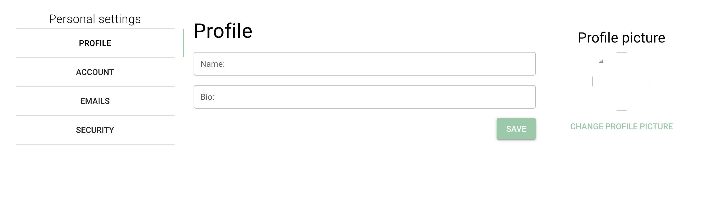

```{r, echo=FALSE}

```

# Purpose

This page allows a user to edit their settings.

# Routes

## API

- databrary.org/my/settings
- nyu.databrary.org/my/settings

## From

- [databrary.org](index.html)
- [landingPageAuth](landingPageAuth.html)
- [landingPageNoAuth](landingPageNoAuth.html)

## To

- [profile](profile.html)
- [account](account.html)
- [emails](emails.html)
- [security](security.html)
