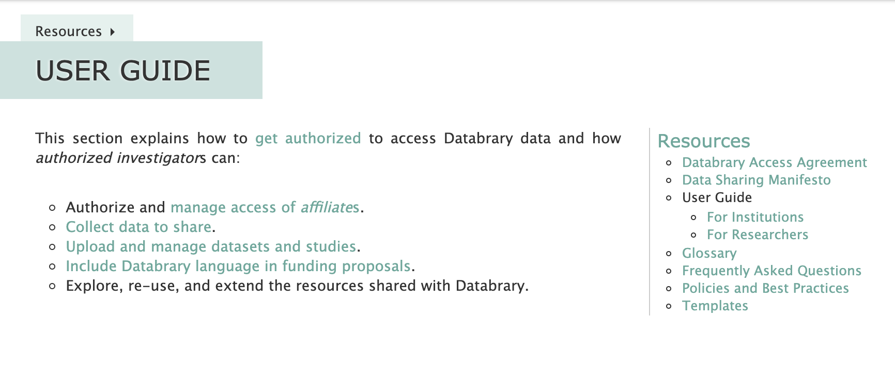

```{r, echo=FALSE}

```

# Purpose

This page provides a user access to resources to learn about Databrary or get user support.

# Routes

## API

- databrary.org/support
- nyu.databrary.org/support

## From

- [databrary.org](index.html)
- [my.Rmd](img/LandingLoggedIn.png)

## To

# Actions


- for Institution Authorized Organizational Representatives
  - Databrary Access Agreement
  - Statement of Rights and Responsibilities - Annex I
  - Additional Authorized Investigators - Annex II
  - Databrary Access Guide - Annex III
  - Terms of Use
  - Privacy Policy
  - Data Security
    - Data and metadata stored in Databrary are subject to the security policies and best practices implemented by NYU. For more information about these policies and services, please visit NYU ITS Computer & Network Security at http://www.nyu.edu/its/security/.
  - [User Guide - for institutions](https://www.databrary.org/resources/guide/institutions.html)
  
- for IRB 
  - Rules for Ethics oversight vs. approval - from ARS email
  - [Work with IRB](https://www.databrary.org/resources/policies/work-with-irb.html)
  
- for Authorized Investigators
  - add a supervised user to my group/lab data
  - add a supervised user to all shared Databrary data
  - What if I leave my institution and no longer have Authorized Investigator Status?
  - What if I my institution requires me to submit an IRB just to access?  
      - Recommended Abstract language: The purpose of this application is to access the Databrary
(https://www.databrary.org/about/about-databrary.html), which is a digital data library specialized
for storing, managing, preserving, analyzing, and sharing video.
I do not currently have data to contribute to the library; however, I would like to have access to its
contents in order to browse the available data and potentially develop a research project. Once I have
a research proposal, I will submit a new protocol for IRB determination.  
    - Access to Identifiers:  I will have access to  elements of dates (except for year) for dates directly related to an individual, including birth date,  Biometric identifiers, including finger and voice prints, and
 Full face photographic images and any comparable images.  
    - Details: The purpose of this application is to access the Databrary
(https://www.databrary.org/about/about-databrary.html), which is a digital data library specialized
for storing, managing, preserving, analyzing, and sharing video. I would like to have access to its
contents in order to browse the data and potentially develop a research idea to submit for IRB
approval in a separate application.
  - When do I need to submit to the IRB to use secondary data? When you move from the preparatory to  research to the research phase. When you move from exploring the feasibility of a coding scheme to deciding to apply it systematically to a set of videos, that’s the transition point. That said, you must still protect the data during pre-research or research planning as you normally would for these sorts of data. That’s why we have the access agreement.
    
    Databrary Policy:  "Because video and audio recordings and photographs may depict faces, voices, names, or other
personally identifying information, special care must be taken. The principles of informed consent
enable participants to decide for themselves whether or not they will allow their data to be shared
with other researchers for other research purposes. The people depicted must give explicit
permission for the recordings or photographs to be shared with Databrary.
In other data formats such as text files and spreadsheets, participants must not be denoted by names
or initials. Personally identifying information must be removed before data are contributed."
 
  
- for Supervised Users
  - request access from my Supervising Professor? Step by Step Instructions
  - I want to access a specific dataset on Datbaray, How do I do this?
  
- for Participants Choosing to Share Data
  - Participant Bill of Rights
As a person who shares information with Databrary, you have the right to:

  - Be free of pressure from anyone else when deciding if you wish to share information
  - Make up your mind about sharing information without being rushed
  - Have the decision to share information with Databrary be separate from the decision to participate in research
  - Be told what information is being shared with Databrary
  - Be told if there will be no direct benefit to you
  - Ask questions about Databrary at any time before, during or after you participate in a study or agree to share information
  - Refuse to share data without penalty
  - Ask to have your data removed from sharing on Databrary, without any penalty
  - Receive a copy of your Databrary release form for you to keep
  - Be assured that your identity will be kept in confidence by Databrary and its authorized researchers.
If I have any questions or concerns I can contact Databrary staff by email at ethics@databrary.org. I can also ask the staff from the study I participated in for help.
  
- How to
  - get authorized as an Authorized Investigator
  - have a supervised user create an account and request access from their Sponsoring Authorized Investigator
  - Authorized Investigators can add Supervised Users
  - Projects
      - create a project
      - update the citation of my project
      - add cited authors vs. non cited researchers
  - document permission from participants
  
- [FAQ](https://www.databrary.org/resources/faq.html) reorganize?
  - what if an authorized investigator is leaving their institution for another institution but should still retain authorized investigator status? 
  - level of access for sessions vs. level of access for each specific file
      -  if they set a sessions folder to a specific level of access, they don't need to do it again for each of the files they upload to that session
  
- User Guide
  - How to create a new project
  - How to upload participant data
  - What file types can be uploaded? (https://nyu.databrary.org/asset/formats)
 
- Templates (upload the updated templates in .doc and .pdf)
  - IRB Application - Databrary Use
  - Data Management Plan
  - Lab Staff Access Agreement
  - Video Data Release, Lab Staff
  - Sharing Release, Video Data Release, Participants
  
- [Glossary](https://docs.google.com/document/d/1pP7L-fp31S8s3uufObLT_Na57OMf0znO1ugGuVfNieM/edit#heading=h.757eov12hzcx)

- Contact Databrary

- Data Sharing Manifesto 
  - Databrary's primary purpose is to foster open data-sharing among a community of researchers in developmental science in particular, and in psychological and neural science more generally.
  - Open data-sharing is entirely voluntary. Investigators choose whether to share, when to share, and what to share. Databrary hopes that most Investigators will choose to share, will share early on in the research process, and will share most or all of the information they have permission to share. But, there is no requirement to do so.
  - Some models for when to share are as follows:
    - At the end of the formal grant period of a federally funded project.
    - Within one year of the date an article is accepted for publication or appears (online or in print).
    - When an article is accepted for publication.
    - At the time of submission of an article for peer review.
  - The more investigators who share and the more information they share, the more the community of researchers will benefit, the more scientists will discover, and the more the public will benefit.
  - Investigators who use information shared by others should follow ethical principles.
    - They should cite resources contributed by other Investigators. Citation is an important currency of scholarly activity.
    - They should contribute data and analyses of their own to Databrary in a timely way. Not everyone has the resources to collect highly valuable data sets. But, secondary analyses of data sets should be shared and linked to their original sources.
    - Investigators who use datasets contributed by others should consider contacting the data contributor when embarking on a new analysis of a contributed data set. It may also be appropriate to invite the data contributor to collaborate.
- Databrary encourages data from unpublished studies to be shared. In fact, Databrary provides an excellent home for them.


# Comments
