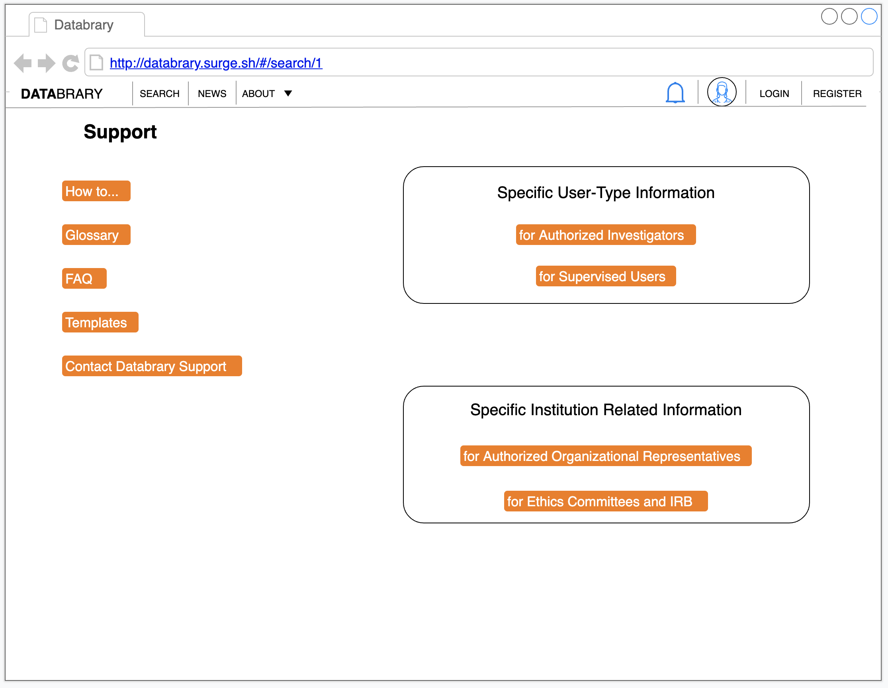

```{r, echo=FALSE}

```

# Purpose

This page provides a user access to resources to learn about Databrary or get user support.

# Routes

## API

- databrary.org/support
- nyu.databrary.org/support

## From

- [databrary.org](index.html)
- [my.Rmd](img/LandingLoggedIn.png)

## To

```{r child = 'headerLinks.Rmd'}
```

# Actions

```{r, child="forAOR.Rmd"}
```


```{r, child="forIRB.Rmd"}
```


```{r, child="forAuthorizedInvestigators.Rmd"}
```  
 
 
```{r, child="forSupervisedUsers.Rmd"}
```  
 
 
```{r, child="forParticipants.Rmd"}
```  
 
  
```{r, child="howTo.Rmd"}
```  


```{r, child="FAQ.Rmd"}
``` 


```{r, child="templates.Rmd"}
```

  
```{r, child="glossary.Rmd"}
```


```{r, child="dataSharingManifesto.Rmd"}
```


```{r, child="contactDatabrary.Rmd"}
```

  

# Comments
