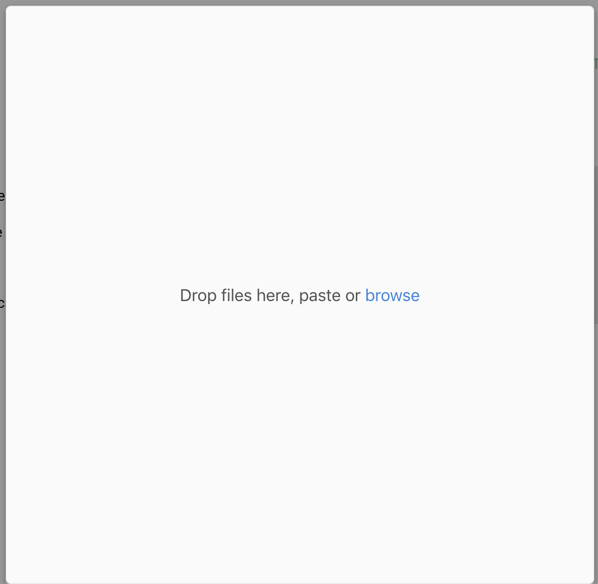

```{r, echo=FALSE, out.width="25%", fig.pos="center"}

```

# Purpose

This modal allows users to upload files to a Project

# Routes

## API

- databrary.org/project/<id>/upload
- nyu.databrary.org/project/<id>/upload

## From

- [thisProjectPage](thisProjectPage.html)

## To

- [thisProjectPage](thisProjectPage.html)

# Actions

- Upload files

# Comments

- Does API call need to specify a "folder" target?